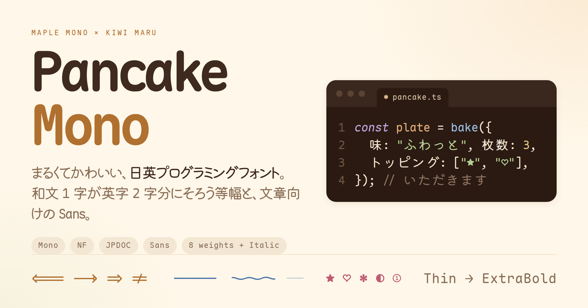
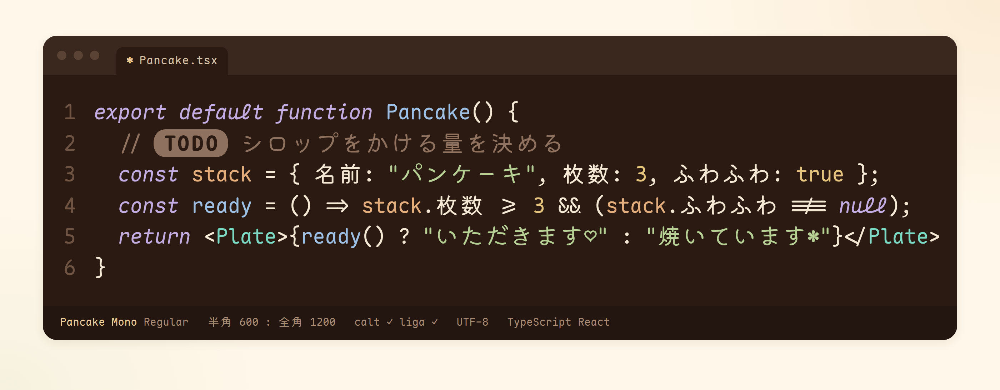
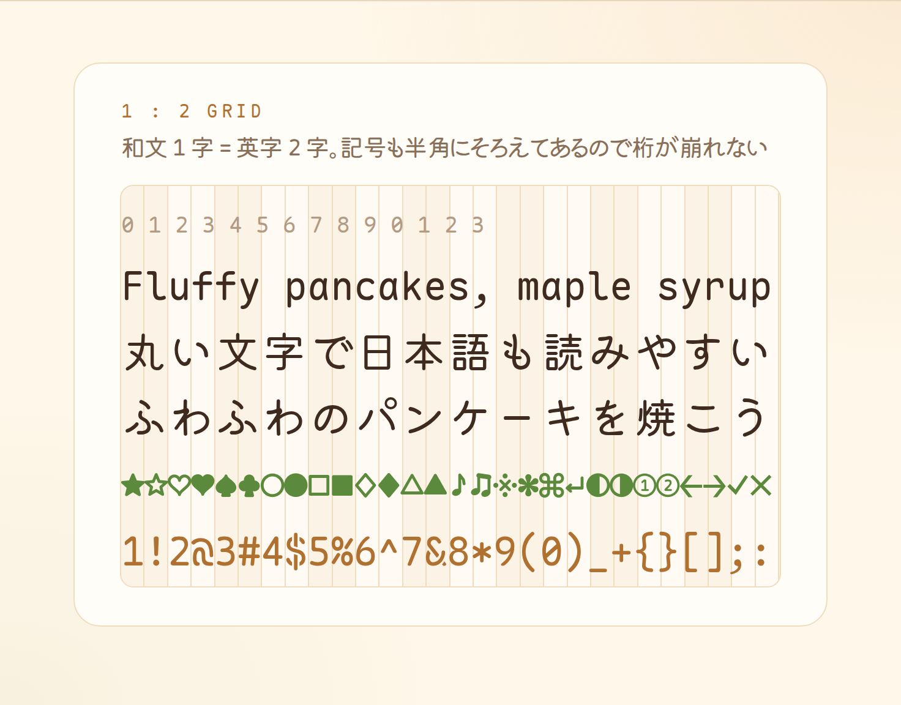
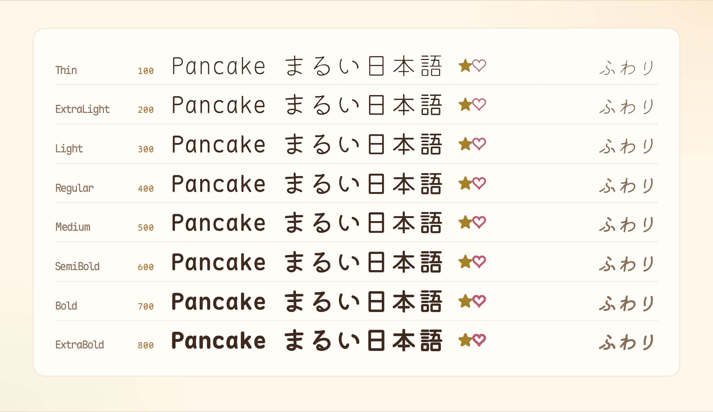
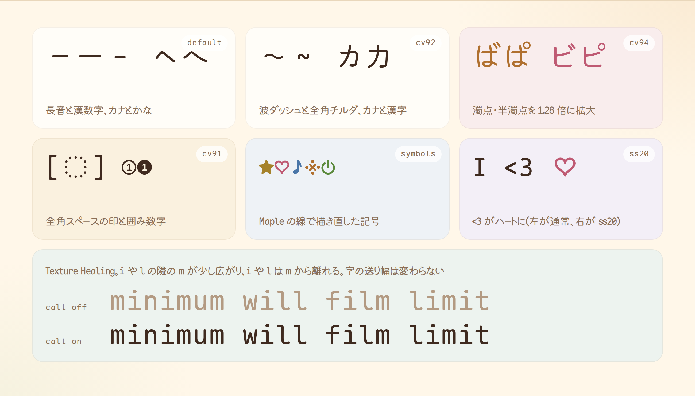
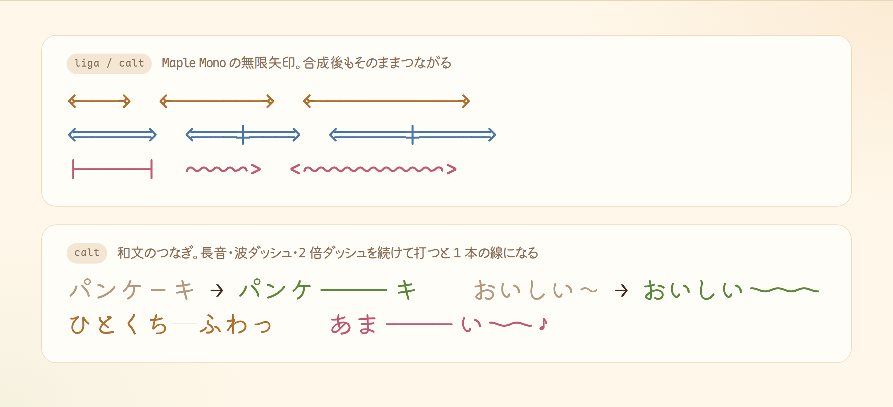

<p align="center">
  
</p>

<h1 align="center">Pancake Mono</h1>

<p align="center">
  まるくてかわいい日英プログラミングフォント<br>
  <sub>英字 Maple Mono × 和文 Kiwi Maru</sub>
</p>

<p align="center">
  
  
  
  
</p>

<p align="center">
  <a href="#ファミリー">ファミリー</a> ·
  <a href="#特徴">特徴</a> ·
  <a href="#使い方">使い方</a> ·
  <a href="#ビルド">ビルド</a> ·
  <a href="#サポート支援">サポート</a> ·
  <a href="#ライセンス">ライセンス</a>
</p>

<p align="center">
  
</p>

## ファミリー

エディタやターミナル向けの等幅版が 3 種類と、文章向けのプロポーショナル版 Pancake Sans があります。どのファミリーにも Thin から ExtraBold までの 8 ウェイトと、それぞれのイタリックがあります。

| ファミリー | 向いている用途 | 中身 |
|:--|:--|:--|
| **Pancake Mono** | エディタ・ターミナル | 半角 600 : 全角 1200 の等幅。英字はヒンティング済み |
| Pancake Mono NF | ターミナルのプロンプト、ファイラー | Pancake Mono に Nerd Fonts のアイコンを追加 |
| Pancake Mono JPDOC | 日本語の文書 | 幅の曖昧な記号(★♡○→※① など)を全角にした等幅 |
| Pancake Sans | 文章・スライド・デザイン | プロポーショナル。カーニングと和欧間のアキ入り |

<p align="center">
  <br>
  <sub>等幅版では、和文 1 字が英字 2 字分の幅にそろいます</sub>
</p>

## 特徴

### 和文と英字のつり合い

和文の線の太さは、どのウェイトでも英字との太さの比が同じになるよう調整しました。Kiwi Maru のウェイトは 3 つしかないので、近いウェイトを元に輪郭を太らせたり細らせたりしています。画数の多い字は、中が潰れないよう太らせる量を控えています。かなは漢字より少し大きく(漢字の 1.10 倍に対して 1.16 倍)して、Maple Mono の大きめの英字とつり合わせました。イタリックでは、和文も英字と同じ 10° 傾きます。

<p align="center"></p>

### 見分けやすさと記号

長音「ー」は短くして、漢数字「一」と区別できるようにしました。カタカナ「ヘベペ」は細く高くして、ひらがなと区別しています。濁点と半濁点の拡大率は 1.28 倍です。全角英数記号には Maple Mono の字形を使うので、「～」と「〜」、「－」と「ー」も形で見分けられます。全角スペースの字形は、点を並べた角丸の枠です。

★♡♪※ などの記号と、Claude Code などのスピナーに使う ✻✳✢⏺◐◓ は、Maple Mono の角丸と線の太さに合わせて描き直しました。スピナーの記号はどの版でも半角なので、コマが変わっても幅は変わりません。

<p align="center"></p>

### つながる記号

Maple Mono の無限矢印リガチャ(`<------>` `<===|===>` など)は、合成後もそのまま動作します。和文でも、長音「ーーー」と波ダッシュ「〜〜〜」を続けて打つと、1 本の線や波につながります。2 倍ダッシュ「――」は、2 つ並べると隙間のない 1 本の線です。

<p align="center"></p>

### Texture Healing と組版

等幅版では、細い字(i l j r t f I 1)の隣にある広い字(m w M W)が少し広がり、細い字はそこから離れます。字の送り幅は変えないので、桁はそろったままです。Pancake Sans では、AV、To、ディ のように片側が開いた字の組をカーニングで詰め、和文と英字が接するところには少しだけ間を入れます。

## 使い方

[Releases](https://github.com/haru0416-dev/pancake-mono/releases/latest) から系統ごとの zip をダウンロードし、中の ttf を OS にインストールして、エディタやターミナルのフォントに指定してください。自分でビルドする場合は[ビルド](#ビルド)を見てください。字形の切り替え(cv・ss)は、目的に合うものだけを有効にします。どれも一律に勧めるものではありません。

| 目的 | 使う系統 | おすすめの設定 | 理由 |
|:--|:--|:--|:--|
| コードを書く | Pancake Mono | デフォルトのまま | 全角スペースの点の枠で、コードに紛れ込んだ全角スペースに気づける |
| ターミナル | Pancake Mono NF | デフォルトのまま | プロンプトやファイラーのアイコンが出る。スピナーの記号は幅が変わらない |
| 日本語の文章をエディタで書く | Pancake Mono JPDOC | `cv91`(全角スペースを空白に) | 段落の字下げなどで全角スペースを意図して使うと、点の枠が目障りになる |
| カタカナ語と漢字が混ざる文字列を読み分ける | Pancake Mono | `cv92` | ログや UI 文字列で「カ」と「力」、「ロ」と「口」を確実に見分けたいとき用。ふつうの文章では、カタカナだけ小さくなって字の大きさがそろわない |
| リガチャが苦手 | Pancake Mono | `calt` を切る | 矢印や `!=` などが記号どおりの見た目になる。和文のつなぎと Texture Healing も一緒に切れる |
| メモやチャット | Pancake Mono | `ss20`(`<3` をハートに) | 遊び用。コードでは `i<3` のような比較もハートになるので使わない |
| 文章・スライド | Pancake Sans | デフォルトのまま | 字の組に応じたカーニングと、和文と英数字の間のアキが入る |

イタリックは、エディタのテーマがコメントやキーワードを斜体で表示するときに、和文も英字と同じ角度でそろえるためのものです。日本語の文章の強調に使うと、長い文では読みにくくなります。

VS Code では、字形の切り替えを `editor.fontLigatures` に書けます。次の例は、日本語の文書を書くときの設定です。

```jsonc
{
  "editor.fontFamily": "Pancake Mono JPDOC",
  // リガチャはそのまま使い、全角スペースは空白で表示する
  "editor.fontLigatures": "'calt', 'cv91'"
}
```

### 字形の切り替え

Maple Mono の cv と ss は、すべてそのまま残しています。和文向けには、次の機能を足しました。

| 機能 | 内容 |
|:--|:--|
| `cv91` | 全角スペースを空白で表示する |
| `cv92` | 漢字と紛らわしいカタカナ(カロエニハタトヘベペ)をさらに小さくする |
| `cv93` | 全角英数記号を Kiwi Maru の字形にする |
| `cv94` | 濁点・半濁点を元の大きさに戻す |
| `ss20` | `<3` をハートにする |
| `jp78` `jp90` `trad` `nlck` `expt` `hwid` | Kiwi Maru の旧字形・旧字体・半角などの切り替え |
| `vert` `vrt2` `vkna` | 縦書き |

## ビルド

ビルドには [uv](https://docs.astral.sh/uv/) と make、zip が要ります。`make` を実行すると、元フォントの取得、等幅版とプロポーショナル版のビルド、検証、見本帳の生成までを順に行います。

```sh
make            # 取得 → ビルド → 検証 → 見本帳
make dist       # dist/ に系統ごとの zip を作る
make tune       # 調整候補を並べた比較ページ(build/tune-board.html)を作る
make woff2      # Web 用に build/woff2/ へ woff2 を出す
```

出力先は、フォントが `build/fonts/{mono,mono-nf,mono-jpdoc,prop}/`、見本帳が `build/kiwi-specimen.html`、配布用 zip が `dist/` です。バージョンは `pyproject.toml` の `version` だけに書き、`v1.0.0` のようにタグを打つと GitHub Actions が Release に zip を添えます。

<details>
<summary><b>デザインの値を調整する</b></summary>
<br>

デザインの値は `config.toml` にまとめてあります。大きさ、位置、紛らわしい字の区別、濁点の大きさ、Texture Healing の強さ、記号の大きさ、カーニングなどが対象です。値を変えて `make` し直せば反映されます。1 つの値だけを試すときは、次のように実行してください。

```sh
uv run python scripts/build.py --only Regular --variants plain --no-hint -j 1 \
  --set mono.scale_kana=1.2 --outdir build/try
```

</details>

<details>
<summary><b>ファイルの構成</b></summary>
<br>

| ファイル | 役割 |
|:--|:--|
| `scripts/fetch_sources.sh` | 元フォント(Maple Mono v7.9、Kiwi Maru)を `sources/` に取得 |
| `scripts/build.py` | 等幅版(通常・NF・JPDOC)の合成 |
| `scripts/build_prop.py` | 等幅版からプロポーショナル版を作る |
| `scripts/kerning.py` | プロポーショナル版の自動カーニング |
| `scripts/symbols.py` | 描き直した記号の形 |
| `scripts/check.py` | 検証(OTS、収録字、幅、各機能の動作、線の太さの比など) |
| `scripts/specimen.py` | 見本帳の生成 |
| `scripts/woff2.py` | Web 用 woff2 への変換 |
| `scripts/tune.py` | 調整候補の比較ページの生成 |
| `scripts/fontutil.py` | 共通の設定読み込みと、輪郭を測る道具 |
| `scripts/images.html` | README の画像(`resources/`)の元。`make images` が各カード(`.card`)を Playwright で撮影する |

</details>

<details>
<summary><b>ヒンティングについて</b></summary>
<br>

Maple Mono v7.9 のヒンティング済み配布物(TTF-AutoHint と NF)では、無限矢印リガチャが calt に組み込まれておらず使えません。そこで、ヒンティング無しの配布物を元に合成し、そのあと ttfautohint で英字だけをヒンティングしています。

</details>

## サポート・支援

質問・不具合・要望は [Issues](https://github.com/haru0416-dev/pancake-mono/issues/new/choose) のフォームから送ってください。詳しくは [SUPPORT.md](SUPPORT.md) にあります。

このフォントが役に立ったら、[GitHub Sponsors](https://github.com/sponsors/haru0416-dev) か [Buy Me a Coffee](https://buymeacoffee.com/haru.dev) で支援してもらえるとうれしいです。

## ライセンス

フォントのライセンスは [SIL Open Font License 1.1](OFL.txt) です。OFL の定める Font Software にはビルドスクリプトも含まれるため、このリポジトリのスクリプトも同じライセンスで配布します。

| | 由来 | 著作権 |
|:--|:--|:--|
| 英字 | [Maple Mono](https://github.com/subframe7536/maple-font) | Copyright 2022 The Maple Mono Project Authors |
| 和文 | [Kiwi Maru](https://github.com/Kiwi-KawagotoKajiru/Kiwi-Maru) | Copyright 2020 The Kiwi Maru Project Authors |
| アイコン(NF 版) | Maple Mono NF に含まれる [Nerd Fonts](https://www.nerdfonts.com/) | 各アイコンの作者 |
